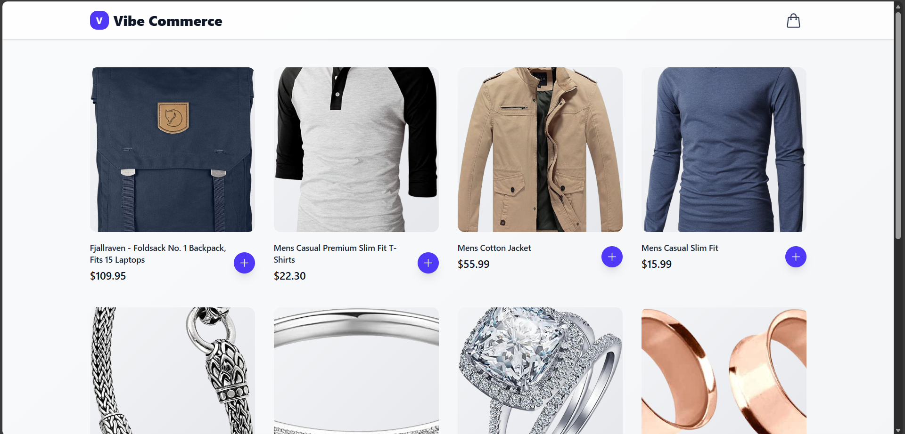
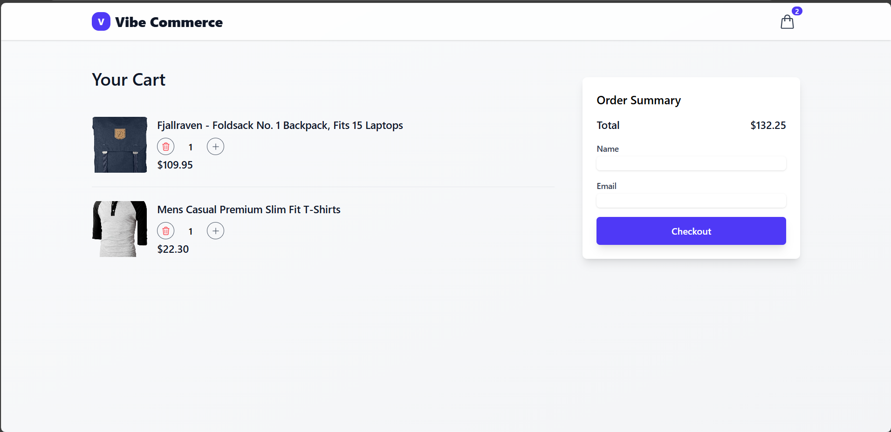

# Vibe Commerce — Full-Stack Shopping Cart

This is a complete full-stack e-commerce shopping cart application built for the Vibe Commerce screening assignment. It features a modern React frontend, a clean Node.js/Express backend, MongoDB persistence, and a full test suite for both sides of the app.

## 📸 Screenshots

- **Product Page**  
  

- **Cart Page**  
  

- **Empty Cart**  
  

---

## 🎨 Frontend Features (React)

- Responsive, mobile-first UI (TailwindCSS)
- Skeleton loaders
- Uniform product grid layout
- Global cart counter synced in real time
- Add/remove/update cart items
- Mock checkout form + confirmation modal
- Framer Motion transitions & animations
- Toast notifications (`react-hot-toast`)
- Top-level error boundary

---

## ⚙️ Backend Features (Node.js)

- MVC architecture for clean structure
- REST API for cart operations
- Persistent carts using a `x-user-id` header (no login system required)
- Zod request validation
- Auto-seeded products on server start

---

## 🛠️ Tech Stack

| Area | Technology |
|------|------------|
| Frontend | React, Vite, React Router, TailwindCSS |
| Backend | Node.js, Express, Mongoose |
| Database | MongoDB |
| Animations | Framer Motion |
| API Client | Axios |
| Validation | Zod |
| Testing | Vitest, RTL, Jest, Supertest, MSW |

---

## 💡 Key Features & Design Choices

### Persistent Carts Without Login
- Frontend stores a unique `userId` in `localStorage`.
- This ID is sent to the backend via `x-user-id`.
- Backend finds or creates a matching user record.
- Cart data stays associated with that user.

### Performance Considerations
- Skeletons for perceived loading speed.
- Lazy-loaded product images.
- Code-splitting using `React.lazy()`.

### Testing Strategy
- **Backend:** Jest + Supertest + in-memory MongoDB.
- **Frontend:** Vitest + RTL + MSW to mock API calls.

---

## ⚙️ Setup & Installation

### Prerequisites
- Node.js v18+
- MongoDB running locally (or a connection URI)

### 1) Clone the Repository
```bash
https://github.com/shivshankargit/vibe-commerce.git
cd vibe-commerce
```

### 2) Backend Setup
```bash
cd backend
npm install
touch .env
```
Create `.env` with:
```env
PORT=5001
MONGO_URI=mongodb://localhost:27017/vibe-commerce
CLIENT_URL=http://localhost:5173
```

### 3) Frontend Setup
```bash
cd ../frontend
npm install
```

---

## 🏁 Running the Application

Open **two terminals**:

**Terminal 1 — Backend**
```bash
cd backend
npm start
```
Your backend runs at: http://localhost:5001

**Terminal 2 — Frontend**
```bash
cd frontend
npm run dev
```
Your frontend runs at: http://localhost:5173

---

## 🧪 Running Tests

### Backend Tests
```bash
cd backend
npm test
```

### Frontend Tests
```bash
cd frontend
npm test
```

---
